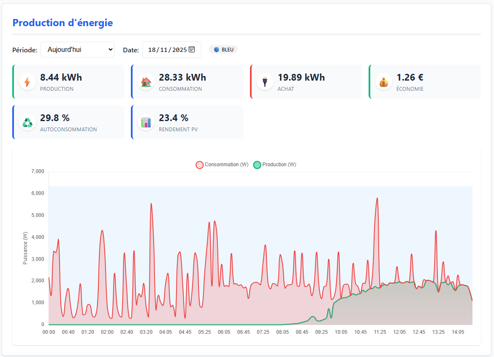

# Hyxi Solar Monitor 🌞

Application web complète pour le monitoring en temps réel de centrale solaire Hyxipower avec intégration des tarifs Tempo.

## 🚀 Fonctionnalités principales

- 📊 **Dashboard en temps réel** - Visualisation instantanée de la production et consommation
- 💰 **Calcul de revenu Tempo** - Intégration automatique des tarifs Tempo (bleu/blanc/rouge, HP/HC)
- 📈 **Graphiques interactifs** - Visualisation sur différentes périodes (jour, semaine, mois, année)
- ⚡ **Métriques avancées** - Autoconsommation, rendement PV, couverture solaire
- 🌤️ **Heures d'ensoleillement** - Intégration avec l'API météo Hyxi pour calcul du rendement
- 🔄 **Rafraîchissement auto** - Mise à jour des données toutes les 30 secondes
- 🐳 **Docker ready** - Déploiement facile avec Docker Compose

## 📸 Captures d'écran

### Dashboard principal
> Visualisation en temps réel de la production, consommation et métriques de performance


### Graphiques avec zones Tempo
> Affichage des tarifs en temps réel avec zones de couleur (bleu/blanc/rouge)


### Métriques détaillées
> Autoconsommation, rendement PV, revenu et couverture solaire



## 📦 Installation rapide

### Avec Docker (recommandé)

```bash
# Cloner le projet
git clone <votre-repo>
cd hyxi-solar-monitor

# Configurer les variables d'environnement
cp .env.example .env
# Éditer .env avec vos clés API

# Démarrer l'application
docker compose up --build -d

# Accéder à l'application
# http://localhost:5000
```

### Sans Docker

```bash
# Créer un environnement virtuel
python3 -m venv venv
source venv/bin/activate  # Linux/Mac
# ou venv\Scripts\activate  # Windows

# Installer les dépendances
pip install -r requirements.txt

# Configurer les variables d'environnement
cp .env.example .env
# Éditer .env avec vos clés API

# Démarrer le serveur
python app/server.py

# Accéder à l'application
# http://localhost:5000
```

## 🔧 Configuration

### Variables d'environnement requises

Créez un fichier `.env` à la racine du projet avec vos informations :

```env
# API Hyxi Cloud (OBLIGATOIRE)
HYXI_ACCESS_KEY=votre_access_key
HYXI_SECRET_KEY=votre_secret_key
PLANT_ID=votre_plant_id

# Optionnel
PLANT_NAME=Ma_Centrale_Solaire
TARIF_VENTE=0.004
RESALE_ENABLED=False
```

> ⚠️ **Sécurité** : Ne jamais commiter le fichier `.env` ! Il est déjà dans `.gitignore`.

### Obtenir vos clés API Hyxi

1. Connectez-vous à votre compte Hyxi Cloud
2. Allez dans les paramètres API
3. Générez vos clés `ACCESS_KEY` et `SECRET_KEY`
4. Notez votre `PLANT_ID` (visible dans l'URL ou les paramètres)

## 📖 Documentation complète

Pour une documentation détaillée, consultez [README_USAGE.md](./README_USAGE.md) qui contient :

- 🏗️ Architecture du projet
- 🔌 Endpoints API REST disponibles
- 💡 Guide de développement
- 🐛 Dépannage
- 📊 Détails des métriques calculées
- 🗺️ Roadmap des fonctionnalités

## 🎯 Utilisation rapide

### Dashboard Web

Accédez à `http://localhost:5000` pour voir :
- Production et consommation en temps réel
- Graphiques avec zones de couleur Tempo
- Métriques : autoconsommation, rendement PV, revenu
- Sélecteur de période (jour/semaine/mois/année)

### API REST

Quelques endpoints utiles :

```bash
# Statut de la centrale
curl http://localhost:5000/api/plant/realtime

# Tarif Tempo actuel
curl http://localhost:5000/api/tempo/now

# Production du jour avec métriques
curl http://localhost:5000/api/energy/production?period=day

# Production de la semaine
curl http://localhost:5000/api/energy/production?period=week&date=2025-11-18
```

## 🏗️ Architecture

```
hyxi-solar-monitor/
├── app/
│   ├── api_client.py      # Client API Hyxi Cloud
│   ├── server.py          # Serveur Flask + routes
│   ├── tempo.py           # API Tempo (tarifs)
│   ├── static/            # CSS, JS, Chart.js
│   └── templates/         # Interface HTML
├── config.py              # Configuration (utilise .env)
├── Dockerfile             # Configuration Docker
├── docker-compose.yml     # Orchestration Docker
└── requirements.txt       # Dépendances Python
```

## 🔐 Sécurité

✅ **Bonnes pratiques appliquées :**
- Clés API stockées dans `.env` (non versionné)
- `.env.example` fourni comme modèle
- Aucune clé sensible en dur dans le code
- `.gitignore` configuré pour exclure `.env`

❌ **Ne JAMAIS :**
- Commiter le fichier `.env`
- Mettre des clés API dans `config.py`
- Partager vos clés publiquement

## 📊 Métriques calculées

- **Autoconsommation (%)** : Part de la production directement consommée
- **Rendement PV (%)** : Production réelle vs capacité théorique (basé sur heures d'ensoleillement)
- **Revenu (€)** : Valeur économique avec tarifs Tempo en temps réel
- **Couverture solaire** : Part de la consommation couverte par le solaire

## 🗺️ Roadmap

### 🔜 Prochainement
- [ ] Base de données MySQL pour historisation
- [ ] Support tarifs Base et Heures Creuses
- [ ] Export des données (CSV, Excel)
- [ ] Alertes de performance

### 💡 Idées futures
- [ ] Prévisions de production
- [ ] Rapports mensuels automatiques
- [ ] Application mobile

## 🐛 Dépannage

**L'application ne démarre pas**
```bash
# Vérifier les logs Docker
docker compose logs -f

# Vérifier le port 5000
sudo lsof -i :5000
```

**Pas de données affichées**
- Vérifier les clés API dans `.env`
- Ouvrir la console navigateur (F12)
- Consulter les logs du serveur

**Erreur API Tempo**
- L'application utilise un tarif fallback si l'API Tempo est indisponible
- Les graphiques afficheront les données sans les couleurs Tempo

## 📝 Licence

Ce projet est fourni à titre d'exemple et d'éducation.

## 🤝 Contribution

Les contributions sont les bienvenues ! N'hésitez pas à :
- Ouvrir une issue pour signaler un bug
- Proposer des améliorations
- Soumettre une pull request

## 📧 Support

Pour toute question :
1. Consultez [README_USAGE.md](./README_USAGE.md)
2. Vérifiez la [documentation API Hyxi](https://open.hyxicloud.com/#/document)
3. Ouvrez une issue sur GitHub

---

Made with ☀️ for solar energy monitoring
